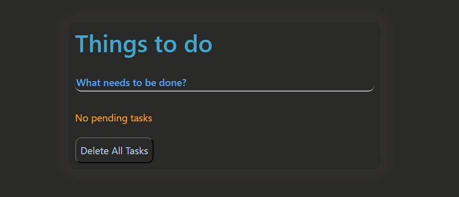
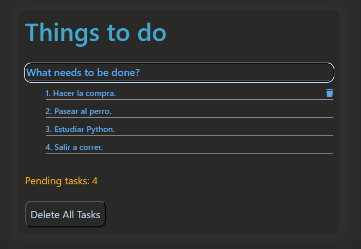

# Aplicación de Gestión de Tareas

Esta es una **aplicación de gestión de tareas** desarrollada en React. Permite a los usuarios agregar, eliminar y listar tareas. La aplicación se conecta a una API para manejar el almacenamiento y recuperación de las tareas.

  
  

### Características:
* **Agregar Tarea**: Permite al usuario ingresar una nueva tarea presionando la tecla Enter.
* **Eliminar Tarea**: Elimina una tarea específica al hacer clic en el ícono de papelera junto a la tarea.
* **Eliminar Todas las Tareas**: Permite eliminar todas las tareas al hacer clic en el botón correspondiente.
* **Mostrar Tareas**: Muestra una lista de tareas pendientes. Si no hay tareas, muestra un mensaje correspondiente.
* **Interfaz Dinámica**: Actualiza la interfaz de usuario automáticamente en función de las acciones del usuario, como agregar o eliminar tareas.
  
### Tecnologías Utilizadas:
* **React**: Biblioteca frontend para construir interfaces de usuario.
* **Fetch API**: Utilizada para manejar solicitudes HTTP y comunicarse con la API backend.
* **FontAwesome**: Utilizado para los íconos de la interfaz de usuario, como el ícono de papelera.
* **CSS**: Para el estilo y la apariencia de la aplicación.

### Cómo Usar:
1. **Clonar el Repositorio**: Clona el repositorio en tu máquina local usando `git clone <URL del repositorio>`.
2. **Instalar Dependencias**: Navega al directorio del proyecto y ejecuta `npm install` para instalar todas las dependencias necesarias.
3. **Iniciar el Servidor de Desarrollo**: Ejecuta `npm run start` para ejecutar la aplicación en modo de desarrollo.
4. **Agregar Tareas**: Escribe una tarea en el campo de entrada y presiona Enter para agregarla.
5. **Eliminar Tareas**: Haz clic en el ícono de papelera junto a una tarea para eliminarla.
6. **Eliminar Todas las Tareas**: Haz clic en el botón "Delete All Tasks" para eliminar todas las tareas pendientes.

### Contribuciones
Las contribuciones son bienvenidas. Si deseas contribuir al proyecto, por favor sigue estos pasos:
1. Haz un fork del repositorio.
2. Crea una rama para tu funcionalidad o corrección de errores.
3. Envía un pull request con una descripción clara de los cambios.

